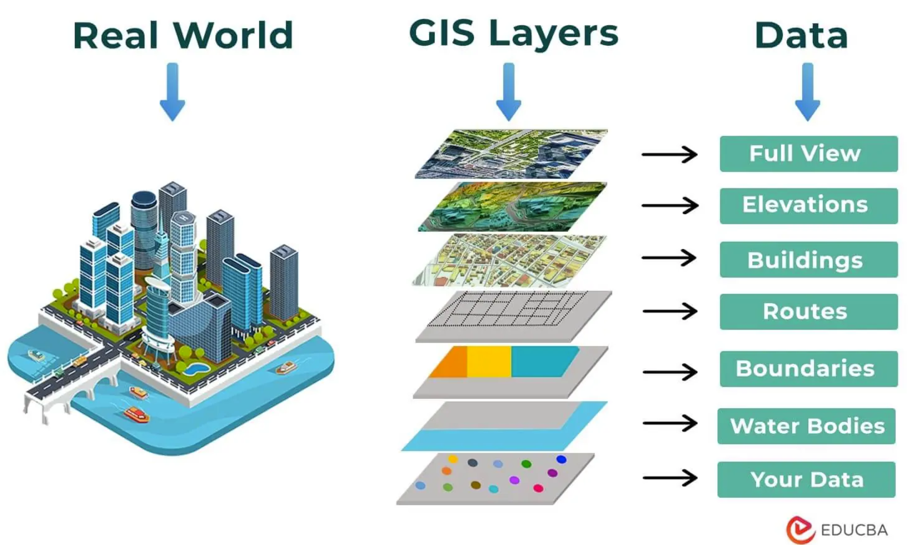
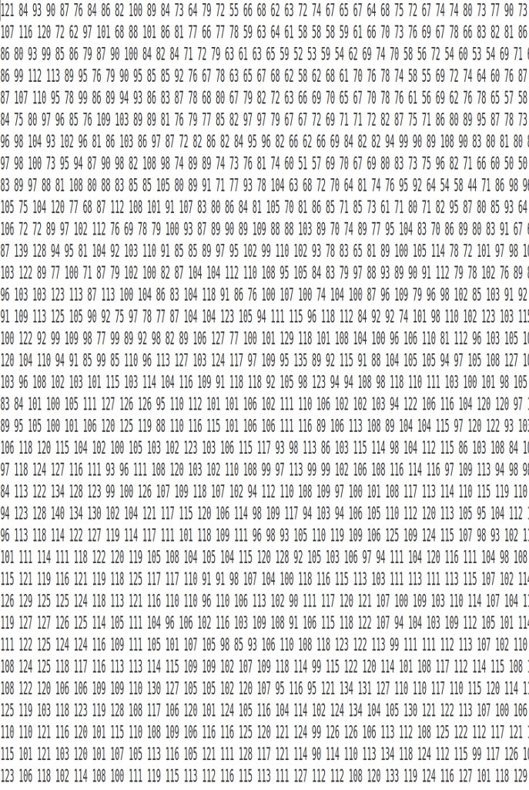
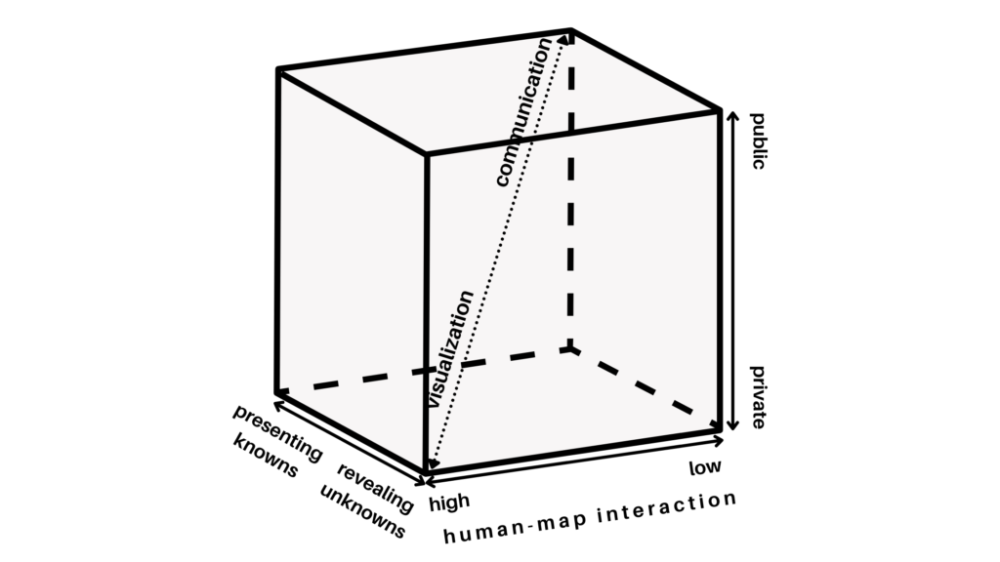
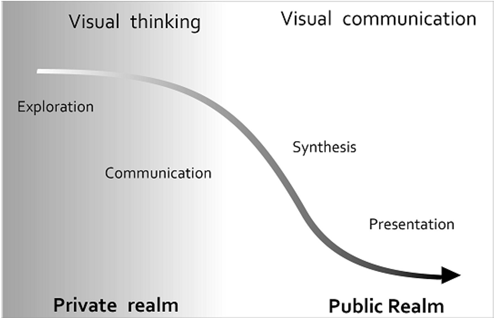
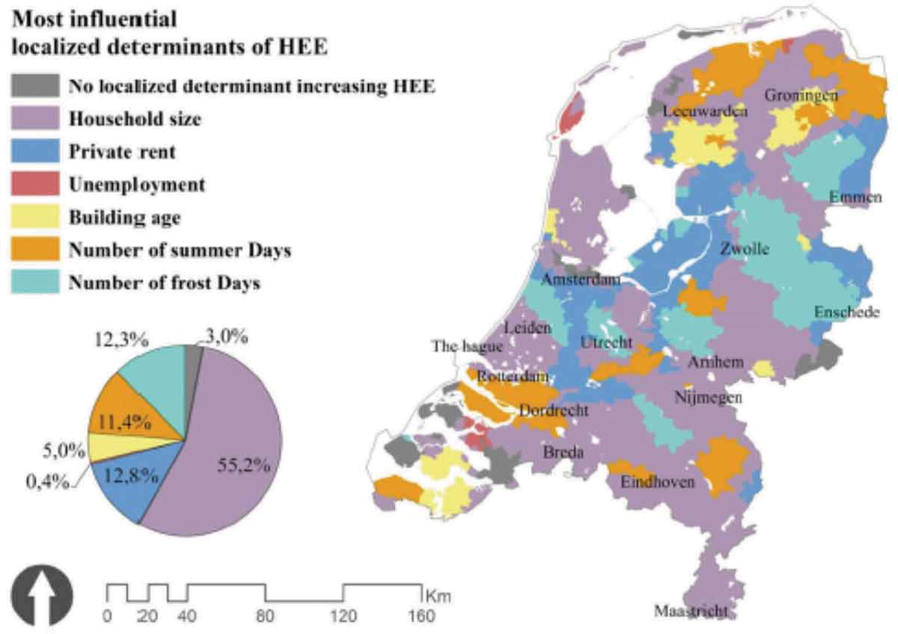
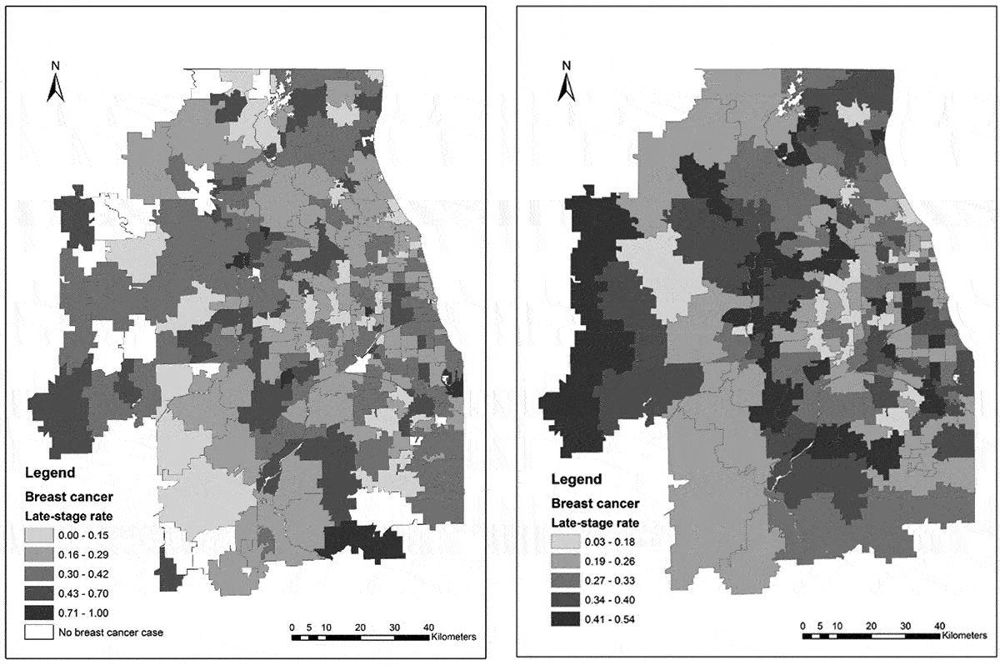
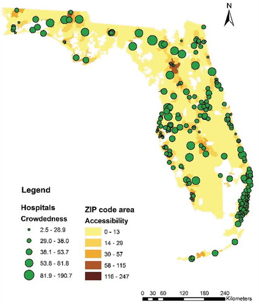

# Introduction

## Introduction

-   Public health - demands a broader view!
-   The need for participatory decision making in public health
-   The transparency of open data science approach

The third upcoming area of research methods

-   Observational
-   Experimental
-   Computational/data science/ML/AI, etc.

---

### What information does GIS use?

-   Data that defines geographical features like roads, rivers
-   Soil types, land use, elevation
-   Demographics, socioeconomic attributes
-   Environmental, climate, air-quality
-   Annotations that label features and places

---

## What is (Geo)-Spatial Data Science?

-   **Analyse** and **extract** insights from geospatial data
-   Work with **real-world data** on a number of domains and problems
-   Acquire key **data science skills** and important tools to answer spatial questions

::: {.fragment}
::: mark
A valuable tool for public health policy advocacy
:::
:::

---

### The Process of Geospatial Data Science

{fig-align="center" width="90%" height="90%"}

---

### Mininum skills for public health data science

**Hard Skills** - Programming Language - Transparency and Reproducibility

**Soft Skills** - Communication - Storytelling - Geospatial analytics - Ethical skills

## Tools for Spatial Data Science (SDS)

### Graphical User Interfaces (GUIs)

-   QGIS and GRASS has revolutionized Open source Geographic Information Systems (GIS).
-   However, the reproducibility aspect has many challenges

### Command Line Interfaces (CLIs)

- R and 
- Python 

are a good way to bring in reproducible algorithms for GIS/SDS

## The Geodata 'revolution’

### Advanced Hardware

-   High-performance computer hardware
-   Efficient algorithms to process vast data sets

### Scalable Software

-   Scalable solutions with the R
-   extract valuable insights from the noise

### Spatial Databases

-   The advent of spatial databases

## Healthcare Data

Traditionally data in healthcare are:

-   Collected for the purpose (carefully designed)
-   Detailed and informative ("rich profile and portraits")
-   High quality

However, they are:

-   Massive enterprises (very costly)
-   Coarse resolution (need to be aggregated to protect privacy)
-   Slow - the more detailed, the less frequent they are available

---

### Examples of Health related data

-   Decennial census (census geographies)
-   Longitudinal surveys
-   Custom collected surveys, interviews etc.
-   Economic or well-being indicators

## *New Forms* of Spatial Data

- Tied into the Geodata revolution

- Accidental: created for different purposes but available for analysis as a side product

- Diverse: resolution and quality but, potentially much more detailed in both space and time

## Challenges (Arribas-Bel, 2014)

-   Bias
-   Technical barriers
-   Methodological "mismatch"

# (Geo)-Spatial Visualization

## Spatial Visualization
::: grid
::: g-col-6

{fig-align="center" height="425"}
:::

::: g-col-6
{fig-align="center" height="425"}
:::
:::

By encoding information visually, they allow to present large amounts of numbers in a meaningful way.

::: {.content-visible when-format="revealjs"}

::: {.columns}

::: {.column width="50%"}
{fig-align="center" height="425"}
:::

::: {.column width="50%"}
{fig-align="center" height="425"}
:::

:::

By encoding information visually, they allow to present large amounts of numbers in a meaningful way.

:::

## A Map for Everyone

### A Real Public Health Tool

- Maps can fulfill several needs, looking very different depending on the end-goal.

### Three Main Dimensions

-   Knowledge of what is being plotted
-   Target audience
-   Degree of interactivity

::: aside
MacEachren & Kraak (1997)
:::

## MacEachren & Kraak (1997)

{fig-align="center" height="85%"}

## DiBiase’s (1990) "Swoopy"

Translating numbers into a (visual) language that the human brain "speaks better"

{fig-align="center" width="80%"}

## Exploratory Visualization

 
> "forces us to notice what we never expected to see"

::: {.flushright data-latex=""}
_(Tukey 1977: vi)_
:::

 

-   Mostly for researchers in the course of the research process.

-   Many, quick and dirty, and rather unattractive graphs.

## Explanatory Visualization
 
> "forces readers to see the information the designer wanted to convey" 

::: {.flushright data-latex=""}
_(Kosslyn 1994: 271)_
:::

 

-   Mostly for others after the research is completed.

-   Few, carefully crafted, and attractive graphs.

## Choropleths

> **Thematic map in which values of a variable are encoded using a colour gradient of some sort**

-   Counterpart of the histogram

 

Both allows us to guage the distribution of a variable.

# Spatial Weights

## Spatial Weights

For a statistical method to be explicitly spatial, it needs to contain some representation of the geography, or spatial context. 

### (Geo)-Spatial Visualization: 

- translating numbers into a (visual) language (colors) that the human brain can interpret.

### Spatial Weights Matrices:

- translating geography into a (numerical) language that a computer can interpret.

## Spatial Weight Matrices

Spatial Weights Matrices are building block for spatial analysis and statistics.

- They are used to assign a weighted average or sum of neighbouring data values to an observation, or other point in space.

- Relates to concepts of spatial ‘smoothing’ and interpolating data

## Applications of Spatial weights 

Spatial weights form the core element in several spatial analysis techniques

-   Spatial autocorrelation
-   Spatial clustering/geo-demographics
-   Spatial regression

## Spatial Heterogeneity

Most influential local determinants of household energy expenditure 

{fig-align="center" width="80%"}

::: aside
Mashhoodi et al., 2019 (doi:10.1080/19475683.2018.1557253)
:::

## REDCAP and MLR

Late-stage breast cancer rates in Chicago region in 2000: (a) ZIP code areas, (b) REDCAP-constructed areas 

{fig-align="center" width="80%"}
::: aside
Wang et al., 2015 (doi:10.1080/19475683.2019.1702099)
:::

## 2SFCA

- Two-step floating catchment area (2SFCA) method
- Hospital potential crowdedness

{fig-align="center" width="80%"}

::: aside
Wang et al., 2018 (10.1080/19475683.2019.1702099)
:::

# Recap