## GIS and Public Health

::: columns
::: {.column width="40%"}
-   Extremely useful in providing a fresh outlook to public health.

-   Provides opportunity to enable overlaying data with its spatial representation

-   Supports better planning and decision-making.

-   The convergence of many new sub-disciplines:

    -   medical geography
    -   public health informatics
    -   data science
:::

::: {.column width="60%"}
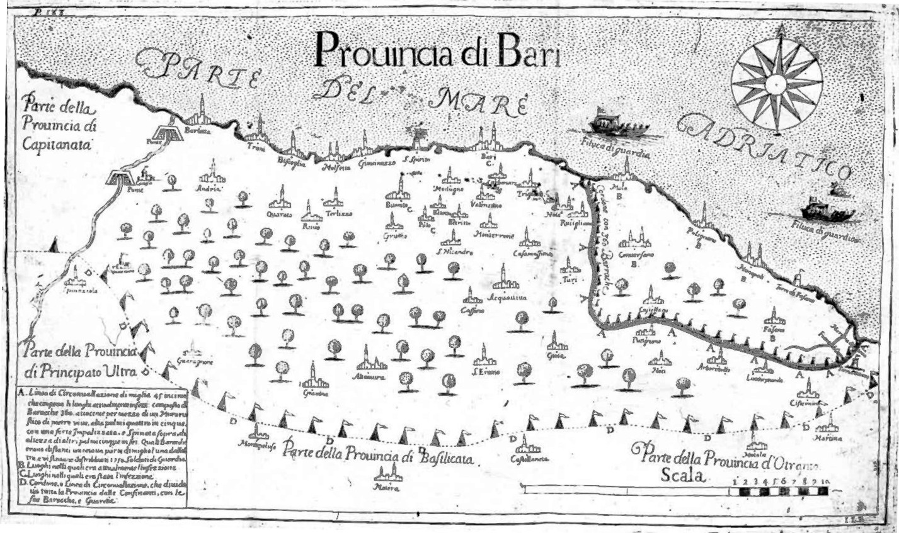

::: {style="font-size: 70%;"}
Map of the plague in the province of Bari, Naples, 1690-1692\

The map shows areas most affected and the boundaries of a military quarantine imposed to prevent its spread to neighboring towns and to other provinces.
:::
:::
:::

::: footer
Koch T. Mapping the miasma: air, health, and place in early medical mapping. Cartographic Perspectives. 2005 Sep 1(52):4-27.
:::

### Applications of GIS in Public Health

-   disease surveillance
-   environmental health
-   infectious diseases
    -   mathematical modelling
    -   agent based modelling
-   population genetics
-   medical imagining
-   cancer biology

::: columns
::: {.column width="50%"}
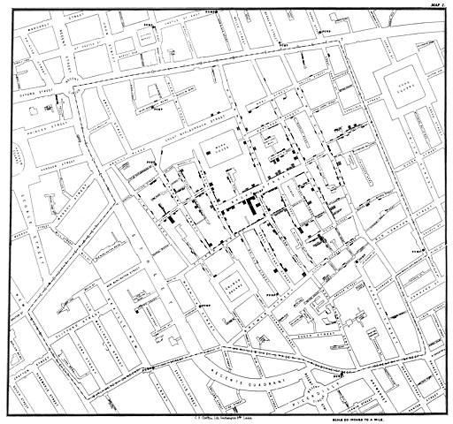{width="600"}
:::

::: {.column width="50%"}

{ width="600"}

:::
:::

While traditional uses of GIS in healthcare still are relevant, newer methods and advancing technology would be monumental for public health research.

## What is Spatial Data Science?

::: columns

::: {.column width="70%"}

::: {.callout-note }

## Definition

 

Spatial data science (SDS) is a subset of Data Science that focuses on the unique characteristics of spatial data,  moving beyond  simply looking at where things happen to understand why they happen there.

> CARTO  - [https://carto.com/what-is-spatial-data-science](https://carto.com/what-is-spatial-data-science)
:::

:::

::: {.column width="30%"}
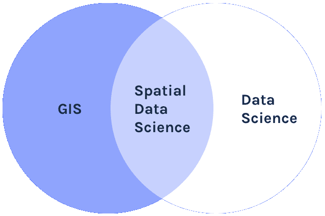
:::

:::

Like data science, spatial data science seems to be a field that arises bottom-up in and from many existing scientific disciplines and industrial activities concerned with application of spatial data, rather than being a sub-discipline of an existing scientific discipline. 

> Edzer Pebesma, Roger Bivand   - Spatial Data Science
With Applications in R 

::: footer

[https://r-spatial.org/book/](https://r-spatial.org/book/)

:::

### How is it different from Data Science?

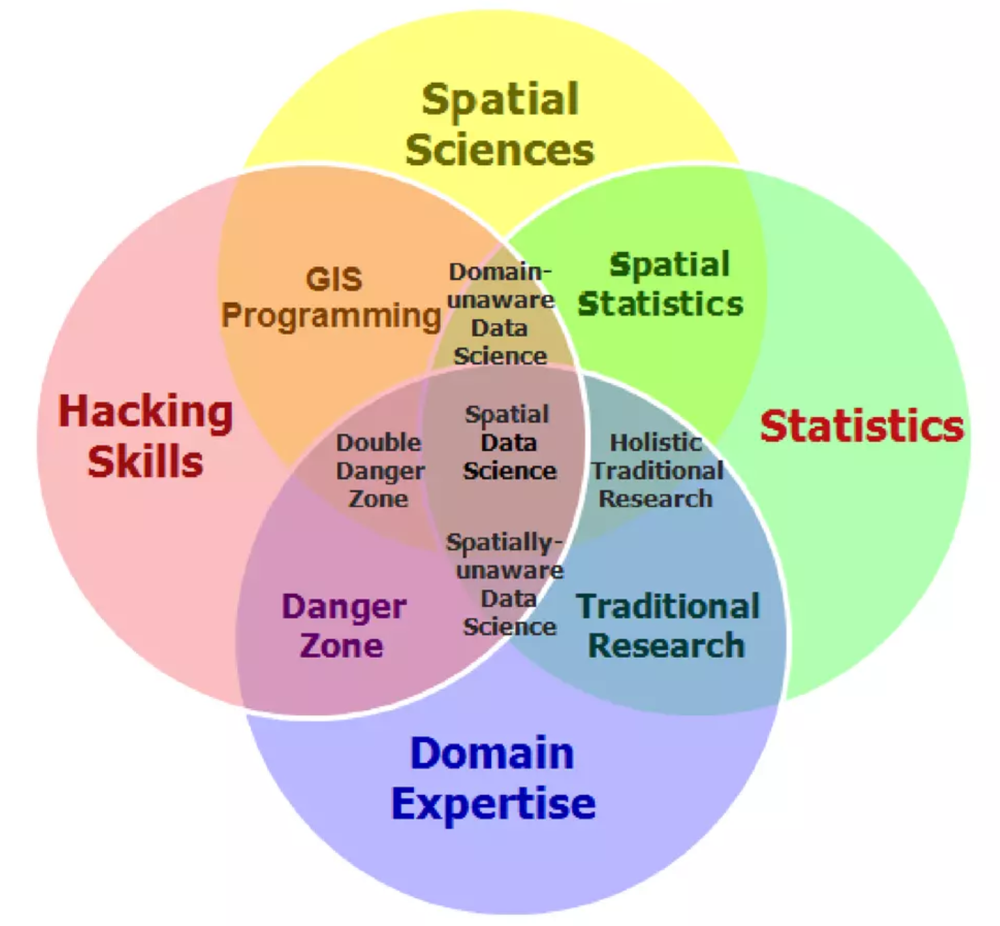

### Why Spatial Data Science for Public Health? 

::: columns
::: {.column width="50%"}
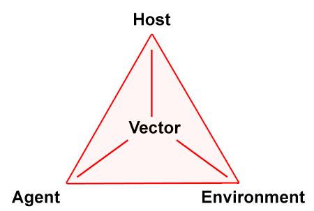{ width="300"}
:::

::: {.column width="50%"}

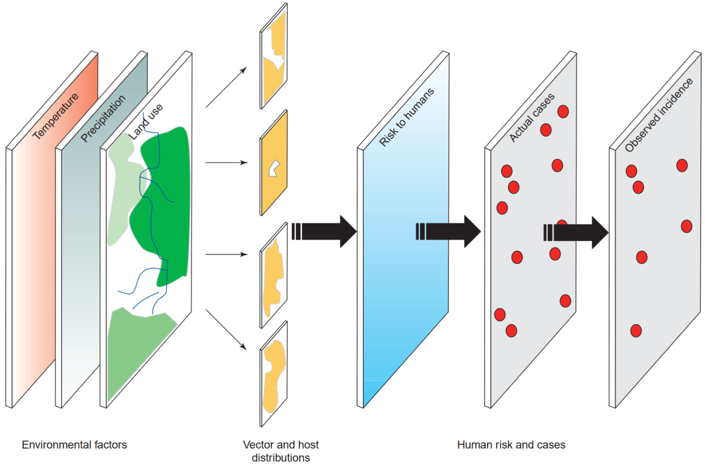{ width="600"}

:::
:::

 

### Potential of Spatial Data Science for Public Health

- Wealth of Spatial Data

- 70% of all data that is generated data has spatial attributes

- Routine health data can be geo-referenced

- Provide a gateway for researchers and practitioners to examine the role and harness the power of SDS in public health

- Coupled with the emerging field of spatial statistics, the analysis of this location-based data is developing new and novel directions for public health.

## Core Concepts related to GIS

Spatial data are fundamental to many geographical analyses and spatial data science draws strongly from key geographical concepts

 

### First Law of Geography

::: columns
::: {.column width="70%"}

::: {.callout-note }

### Tobler's First Law

*"Everything is related to everything else, but near things are more related than distant things"*

> Waldo Tobler, 1970

:::

:::
::: {.column width="25%"}

:::
:::

### Spatial Dependence and Complete Spatial Randomness
 

Spatial dependence is *"the propensity for nearby locations to influence each other and to possess similar attributes"*.

::: columns
::: {.column width="60%"}
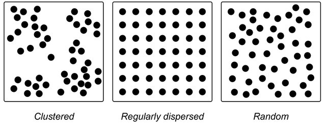{width="900"}
:::

::: {.column width="40%"}

This means natural phenomenon are not spatially distributed at random.

- temparature,
- rainfall,
- population density,
- socio-economic conditions etc.

:::

:::

It can be measured by the indices of Spatial Autocorrelation.

### Spatial Autocorrelation

Refers to the presence of systematic spatial variation in a mapped variable.

The terms **spatial association** and **spatial dependence** are often used to reflect spatial auto-
correlation as well.

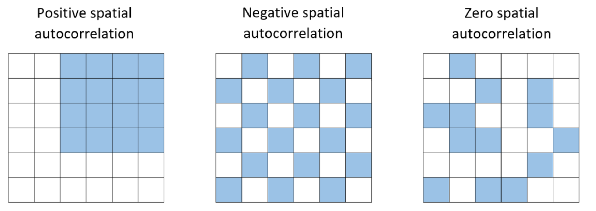

### Indices to measure Spatial Dependence

::: columns
::: {.column width="50%"}

- Covariance Functions and Variograms

- Global Spatial Autocorrelation Measures
  - Moran’s *I* index
  - General *G*-Statistic
  - Geary’s *C* index

- Local Indicators of Spatial Association (LISA)
  - Local Moran’s *I* index
  - Getis-Ord *G*~*i*~ and *G*~*i*~^∗^ statistics

- Space-Time Correlation Analysis
  - Bivariate Moran's *I* for STC
  - Differential Moran's *I*
  - Emerging Hot Spot Analysis (EHSA)

:::

::: {.column width="50%"}

::: fragment
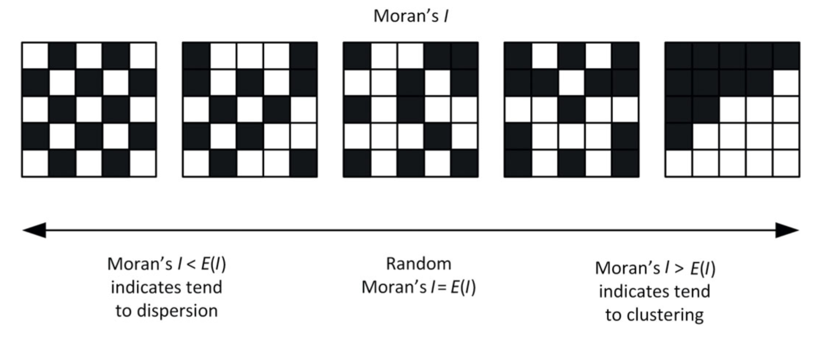
:::

::: fragment

:::

:::
:::

### Map Projections & coordinate reference system (CRS) 

::: columns
::: {.column width="40%"}

- Map projections try to transform the earth from its spherical shape (3D) to a planar shape (2D).

- A CRS then defines how the two-dimensional, projected map in your GIS relates to real places on the earth.

- The decision of which depends on the extent of the area, analysis type, and often on the availability of data.

:::

::: {.column width="60%"}

{width="800"}

:::
:::

::: footer
[https://docs.qgis.org/3.28/en/docs/gentle_gis_introduction/coordinate_reference_systems.html](https://docs.qgis.org/3.28/en/docs/gentle_gis_introduction/coordinate_reference_systems.html)
:::

### Why is the CRS Important?

#### Earth is a GEIOD

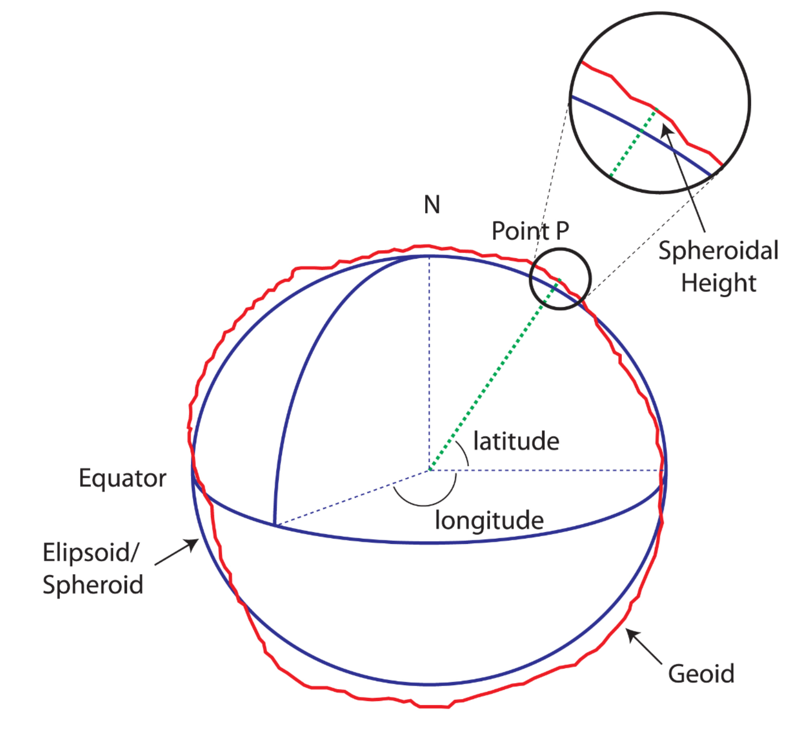

#### Different Projection Systems

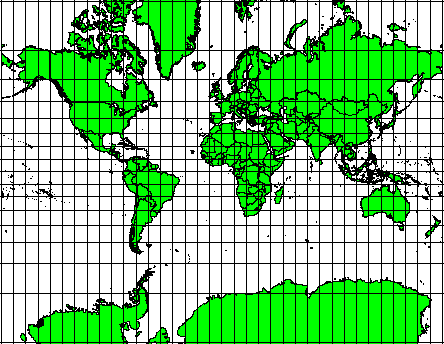

 

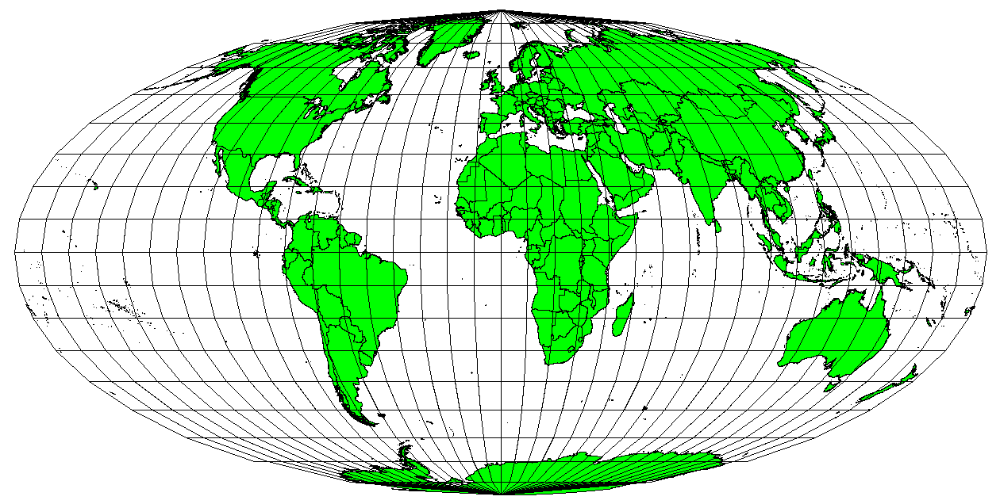

 

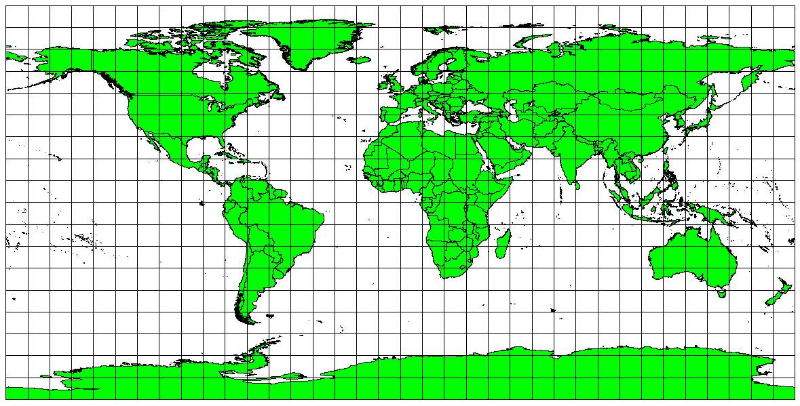

 

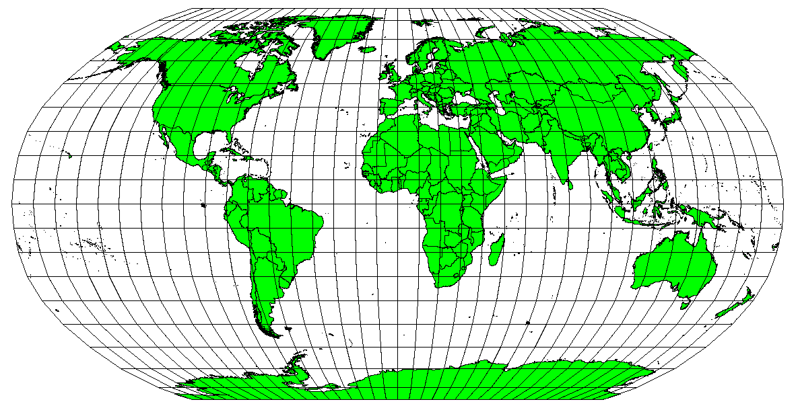

 

 

### CRS in Action

<iframe sandbox="allow-scripts allow-same-origin" src="https://www.thetruesize.com" width="800" height="750"></iframe>

::: footer
[https://www.thetruesize.com](https://www.thetruesize.com)
:::

## Data Science as a methodological approach

::: {.callout-note }

> The key word in  data science is not data, it is science.

 -- Jeff Leek, JHU Data Science Lab

:::

### Reproducible Research

::: columns
::: {.column width="30%"}

:::
::: {.column width="70%"}

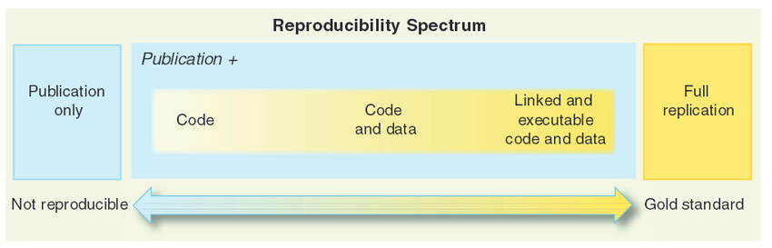{width="900"}
:::
:::

## Reproducible Research

::: columns
::: {.column width="40%"}

 

There are four key elements of reproducible research:

- data documentation
- data publication
- code publication,
- output publication.

:::
::: {.column width="60%"}

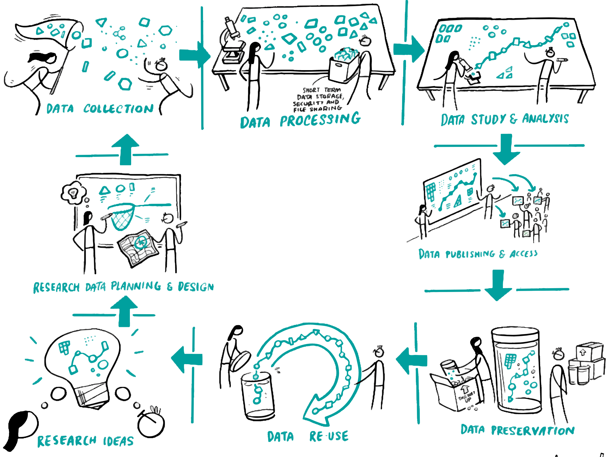

:::
:::

## Tools for Spatial Data Science

::: columns

::: {.column width="40%"}

- GIS related
- Data Science related
- Spatial Data Science related

> R is the best spatial data science tool available for public health !!!

 
R provides a range of powerful packages for geospatial analysis, enabling advanced computations and analytics.

:::
::: {.column width="60%"}

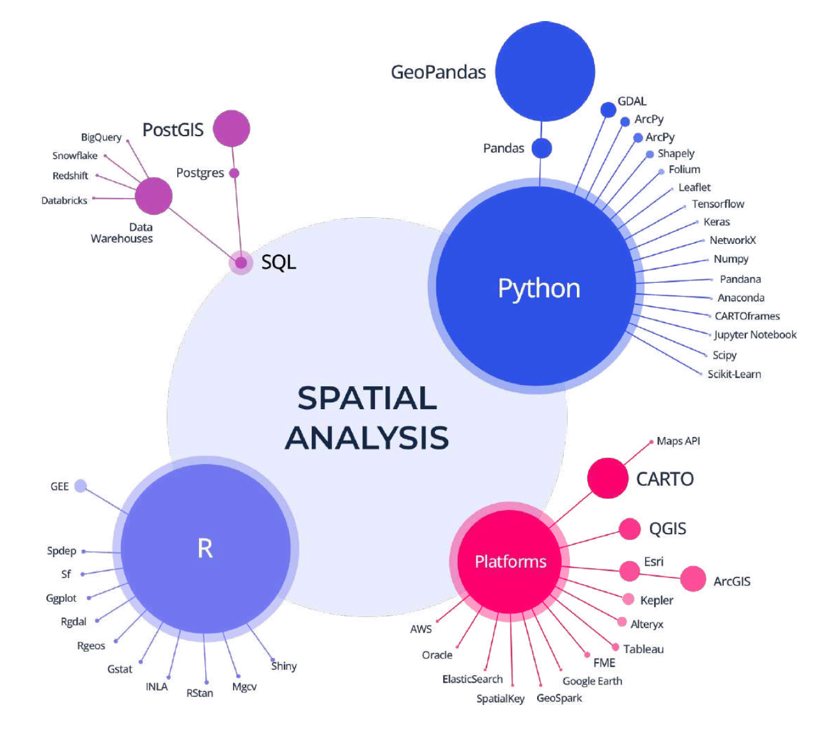
:::
:::

## R Spatial Analysis Ecosystem

:::  columns
::: {.column width="25%"}

 

[CRAN Task View -  Spatial Analysis](https://cran.r-project.org/web/views/Spatial.html)
:::
::: {.column width="75%"}
<iframe sandbox="allow-scripts allow-same-origin" src="https://cran.r-project.org/web/views/Spatial.html" width="600" height="750"></iframe>
:::
:::

::: footer

[https://cran.r-project.org/web/views/Spatial.html](https://cran.r-project.org/web/views/Spatial.html)
:::

## R Spatial Learning Resources

:::  columns
::: {.column width="60%"}
- Wealth of Resource material

- Powerful tools/packages

- seamlessly handle vector and raster data

- inractive visualization

- end-to-end solution

 
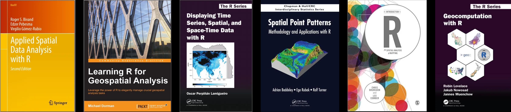

Newest addition: [Spatial Data Science: With Applications in R](https://r-spatial.org/book/)
:::

::: {.column width="5%"}

:::

::: {.column width="35%"}
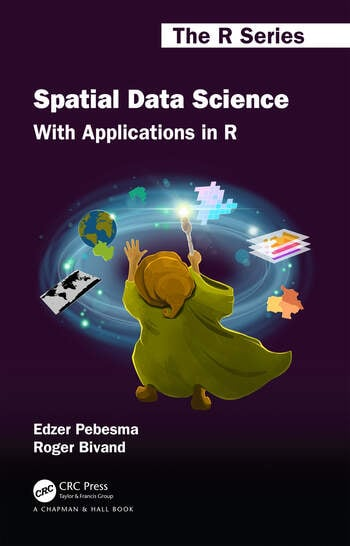{width="500"}

:::
:::

