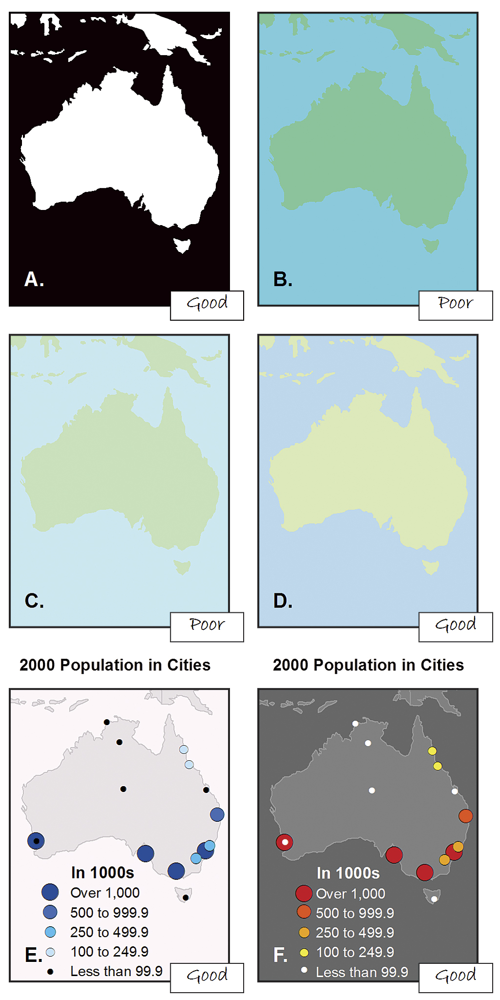
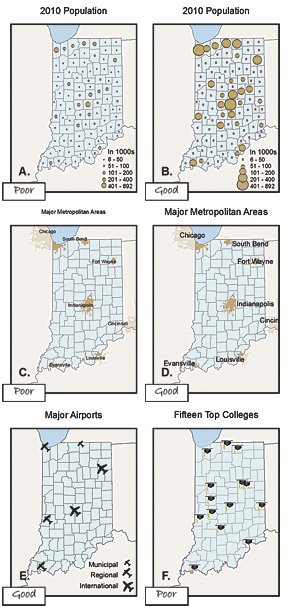
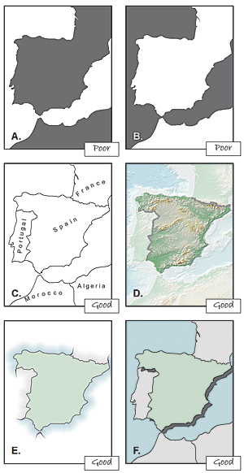
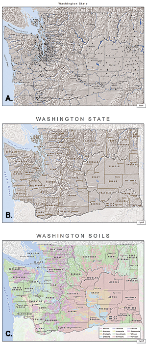
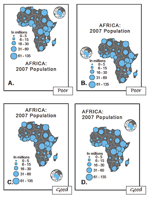
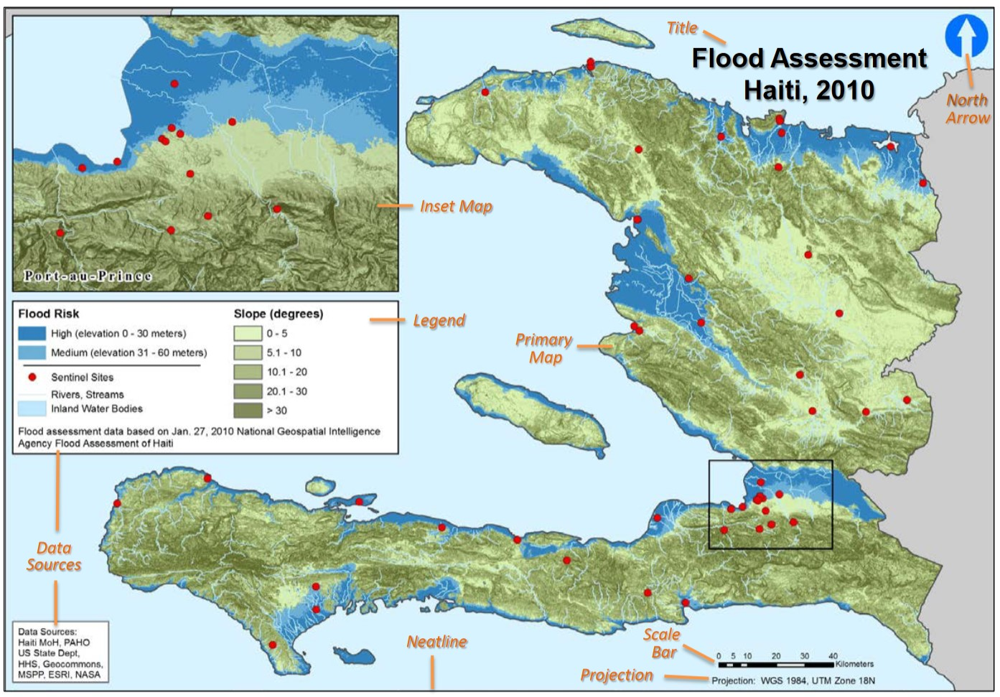

## Why the map comes first

-   In spatial analysis, the map is the primary instrument.
-   A good map encodes a variable so the eye can read pattern, outliers, and gaps.
-   Before any statistic, we *look*.

::: aside
The map is to spatial analysis what the histogram is to ordinary EDA.
:::

---

## Cartographic Principles

GeoSWG best practices for public health cartography:

-   Visual contrast
-   Legibility
-   Figure-Ground Orientation
-   Hierarchical Organization
-   Balance

These keep map products high-quality and consistent across a team.

---

## Design Principles in Practice



---

## Good vs Poor Design

::: {layout-ncol="2"}







:::

---

## Cartographic Guidelines for Public Health

::: columns
::: {.column width="42%"}
-   Source: CDC, Atlanta
-   Map elements:
    -   Title and borders
    -   North arrow / graticule / scale
    -   Inset maps
    -   Labels and legend
-   Other elements:
    -   Data sources, dates, projection
:::

::: {.column width="58%"}
{width="100%"}

<https://www.cdc.gov/dhdsp/maps/gisx/resources/cartographic_guidelines.pdf>
:::
:::

---

## The Choropleth

> A thematic map in which values of a variable are encoded with a colour gradient.

-   The spatial counterpart of the histogram.
-   Three choices decide whether it informs or misleads:
    -   **What** you map: rates, not raw counts
    -   **How** you classify: the breaks (quantile, equal-interval, Jenks)
    -   **Which** colours: sequential vs diverging, colour-blind safe

---

## Rates, not counts

-   Counts mostly track population size, so a count map is often just a population map.
-   Map **rates** (per 1000, per 100k) or proportions to compare places fairly.
-   Small-population areas give unstable rates: a single case swings them. Note this when you read the map.

---

## Colour, classification, accessibility

-   **Sequential** palette for low-to-high; **diverging** for departure from a midpoint.
-   Use colour-blind-safe palettes (`viridis`) and keep classes few (4 to 6).
-   The same data with different breaks tells different stories: always state the scheme.

---

## A map is spatial data

```{r}
#| label: districts-map
#| echo: true
#| message: false
#| warning: false
#| fig-align: center
#| out-width: "62%"
library(sf)
library(tidyverse)
library(here)

districts <- read_rds(here("spatial_files", "india_district_sf.rds"))

ggplot(districts) +
  geom_sf(linewidth = 0.05, fill = "grey95", colour = "grey40") +
  theme_void()
```

District polygons read with `sf`. Geometry plus attributes is all we need to start mapping.

---

## Building a choropleth (pattern to reuse)

```{r}
#| eval: false
#| echo: true
districts |>                                  # an sf object
  left_join(indicator_df, by = "district") |> # attach the variable
  ggplot() +
  geom_sf(aes(fill = stunting), colour = "white", linewidth = 0.1) +
  scale_fill_viridis_c(option = "magma", direction = -1) +
  theme_void()
```

You build exactly this in **Exercise 6** (NFHS stunting). The same recipe drives the maps in
the rest of the module.

## Recap

-   The map is the first instrument: design it with care (contrast, hierarchy, honest rates,
    safe colour).
-   Choropleth choices: **what** (rates not counts), **how** (breaks), **which** (colour).
-   One `sf` + `ggplot2` recipe builds every map in the module.
-   Next: Exploratory Spatial Data Analysis.
