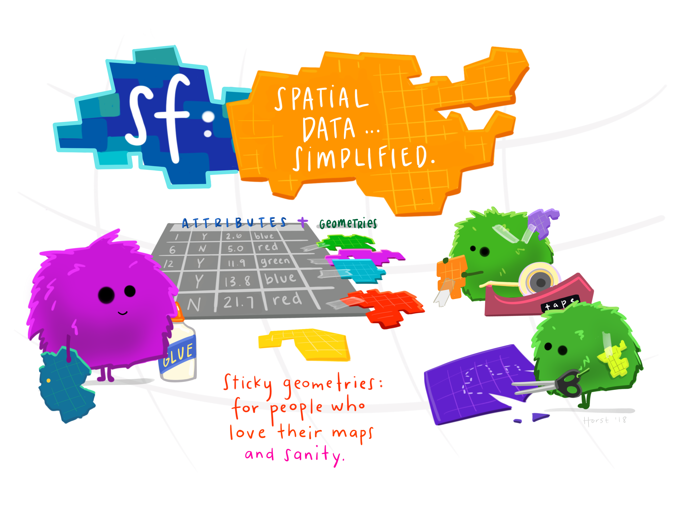
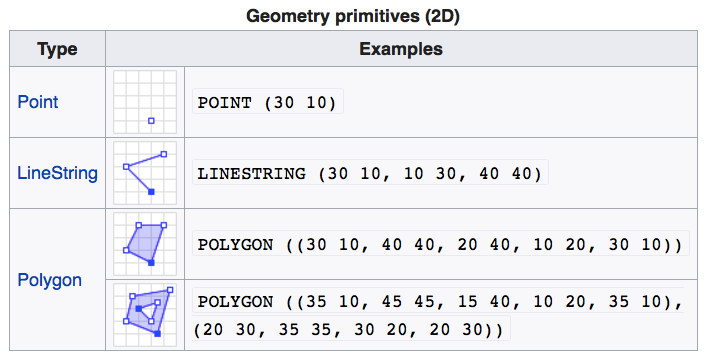
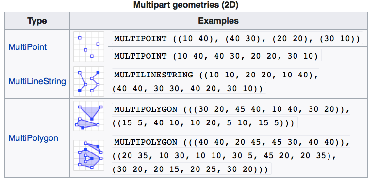
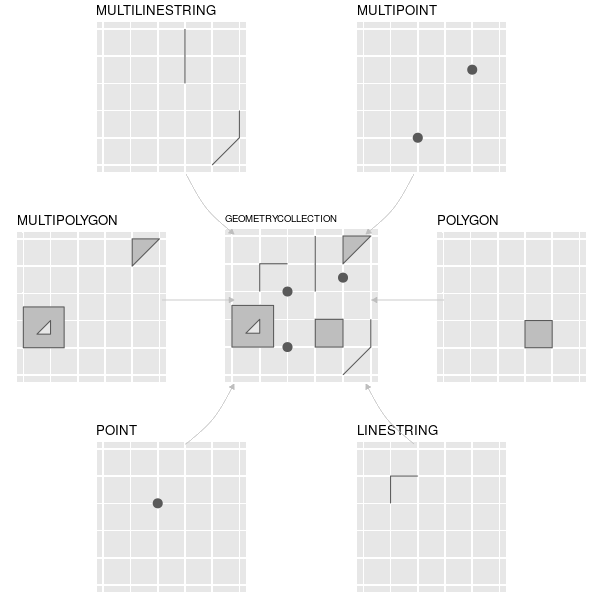
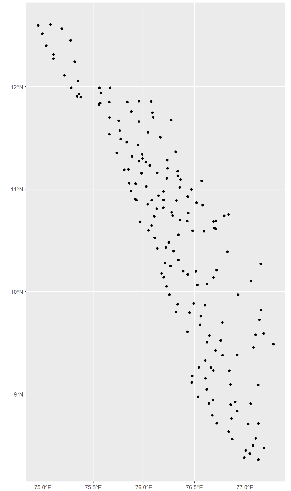
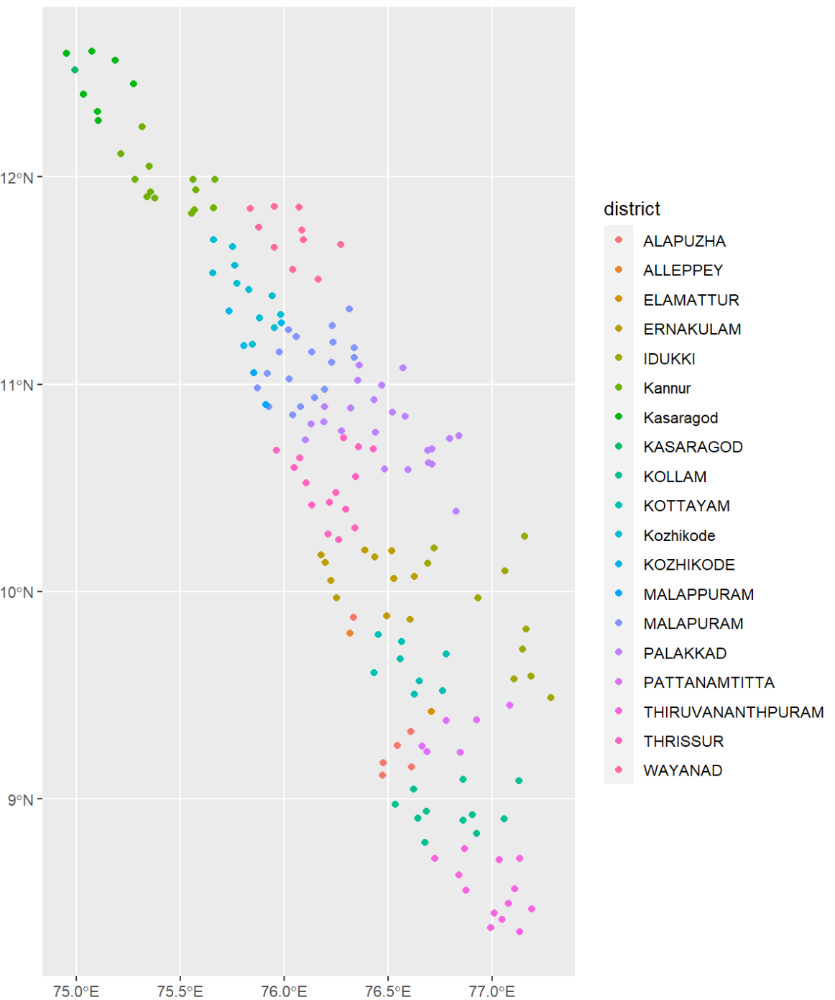
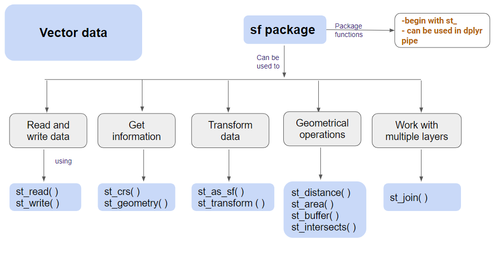
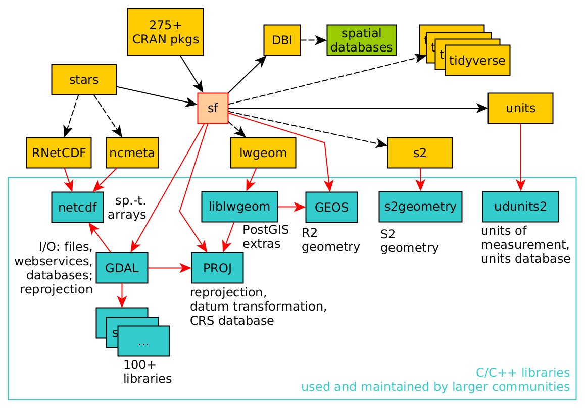
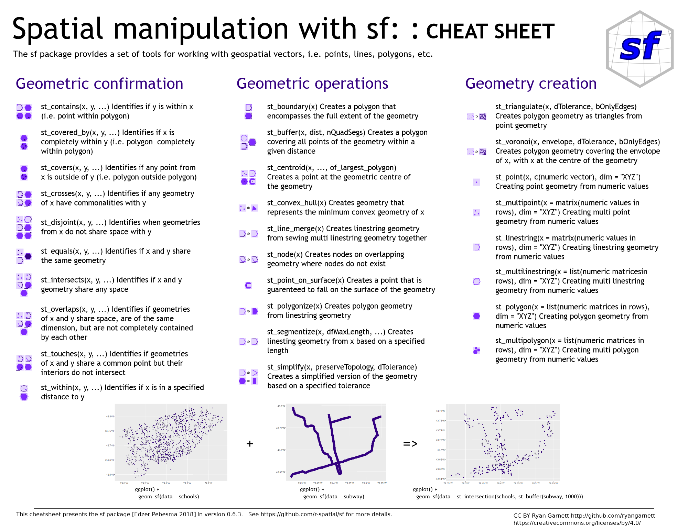

## The `sf` package

::: columns
::: {.column width="45%"}


``` r
install.packages("sf")
```

The **sf** package is an R implementation of [Simple Features](https://en.wikipedia.org/wiki/Simple_Features).

This package incorporates:

-   a new spatial data class system in R

-   functions for reading and writing data

-   tools for spatial operations on vectors


:::

::: {.column width="55%"}


:::
:::


## Geometry Types in `sf`

::: columns
::: {.column width="50%"}



:::

::: {.column width="50%"}
{width="60%"}
:::
:::


## Loading  `sf` package

```{r message=FALSE, warning=FALSE, include=FALSE}
library(tidyverse)
library(here)
```


```{r}
#| echo: true
#| warning: false
#| message: false


library(sf)

fs::dir_tree(here("spatial_files", "kl_pop_centers"))

```

# Load spatial data into R

```{r}
#| echo: true
#| warning: false
#| message: false

shape_file <- here("spatial_files", "kl_pop_centers", "kl_pop_centers.shp")

kl_pop_centers <- st_read(shape_file)


```


## View the `sf` object

```{r}
#| echo: true

kl_pop_centers
```

## Plot the `sf` object


::: columns
::: {.column width="50%"}


```r
kl_pop_centers %>%
  ggplot() +
  geom_sf()

```

:::

::: {.column width="50%"}
{width="500"}

:::
:::


## Plot the `sf` object


::: columns
::: {.column width="55%"}


```r
kl_pop_centers %>%
  ggplot() +
  geom_sf(aes(color = district))

```

:::

::: {.column width="45%"}


:::
:::


## Concept of the `sf` package



## Dependencies of the `sf` package



## Methods in `sf`

```{r}
#| echo: true

methods(class="sf")
```


## Interactive `sf`

::: columns
::: {.column width="70%"}

```{r out.width="100%", out.height="800"}
kl_pop_centers %>%
  mapview::mapview()
```

:::
::: {.column width="30%"}


- Light weight
- Interactive
- Cross Platform
:::
:::
## Where to look for help?

::: columns
::: {.column width="60%"}

:::

::: {.column width="40%"}

:::

https://posit.co/wp-content/uploads/2022/10/sf.pdf
:::


## Challenges and Future Directions

### New Requirements for Spatial Analysis

- Immediate: The time from action to insight is reducing dramatically


- Fresh: Primary data needs to be days or months old  not years old


- Multi-source: Competitive alternative sources for completeness or validation

---

## Challenges and Future Directions (cont.)

### New Requirements for Spatial Analysis

- Continuous: Analysis can no longer be a point in time


- Automated: Possibility to continuously replicate and connect to decision tools

